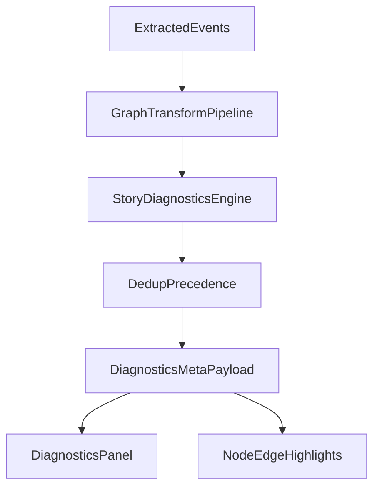

# Story-Graph Diagnostics Plan

## Scope and Delivery

- Delivery strategy: phased rollout.
- Severity baseline: structural graph violations -> `error`; heuristic or low-evidence findings -> `warning`.
- Phase 1 implements graph-derivable categories only; semantic categories are planned for later phases after schema extension.
- Non-goal for Phase 1: full semantic intent inference (motivation, tone, personality) without structured extraction support.
- Operational ownership:
  - implementation owner: graph diagnostics module maintainer,
  - approval owner for rollout gates: engineering lead for narrative-checker web app,
  - on-call response owner for rollback triggers: current release owner.

## Phase 0: Readiness and Contract (Gate)

- Audit available extraction/graph fields required for each Phase 1 rule (time/order, causal links, location, dependencies, entity participation).
- Define fallback behavior per missing field (emit `warning` as insufficient evidence, never hard-fail render).
- Establish a stable diagnostics payload contract in [contracts.ts](/Users/roopamgarg/Development/narrative-checker/web-app/src/lib/contracts.ts):
  - `id`, `category`, `subtype`, `severity`, optional `confidence`, `message`, `evidence` refs, implicated `nodeIds`/`edgeIds`.
- Add dedup/precedence policy so overlapping rules do not emit noisy duplicates.
- Add `diagnosticsSchemaVersion` and backward compatibility rule (new optional fields allowed; required-field changes require version bump).
- Define deterministic diagnostic `id` generation (category + subtype + stable hash of normalized evidence refs).
- Build a Rule Readiness Matrix per Phase 1 rule:
  - required signals,
  - degraded-mode behavior when missing signals,
  - enabled/disabled flag at runtime.

### Phase 0 Exit Criteria

- All Phase 1 rules have a readiness row with explicit fallback semantics.
- Diagnostics schema compiles in strict typing and has passing contract tests.
- UI can safely render empty/partial diagnostics payloads with no runtime errors.

## Phase 1: Implement Core Graph-Derivable Categories

- Implement rule engine module (new `src/lib/story-diagnostics.ts`) with category handlers and shared utilities.
- Timeline Errors:
  - detect time-order cycles, missing temporal links, impossible interval overlaps for same entity.
- Causality Errors:
  - detect effects with no incoming cause, broken causal chains, and circular causal dependencies.
- Spatial Inconsistencies:
  - detect location transitions without travel edges and time-distance constraint violations.
- Redundancy & Cycles:
  - detect duplicate events and non-progress narrative loops.
- Missing Links / Gaps:
  - detect weakly connected components and abrupt transitions lacking bridge events.
- Dependency Violations:
  - detect prerequisite usage before establishment (reversed/missing dependency edges).
- For each rule, define a mini-spec in code comments/docs:
  - inputs required,
  - trigger condition,
  - severity assignment,
  - confidence assignment,
  - suppression/de-dup hooks,
  - evidence payload shape.
- Complexity target:
  - default graph traversals should remain near O(V+E),
  - any pairwise checks must be bounded by entity-local windows or indexed lookups.

### Ambiguous Rule Semantics (Locked for Phase 1)

- Non-progress narrative loop:
  - cycle length between 2 and 6 where no net state/location/dependency change is observed in evidence payload,
  - if cycle includes a distinct resolved dependency edge, suppress loop diagnostic.
- Abrupt transition:
  - adjacent timeline events for same primary entity with state delta above threshold and no causal/dependency/transition edge in between,
  - threshold policy: at least 2 attribute dimensions changed or location plus state changed together.
- Impossible interval overlap:
  - same entity assigned to distinct locations in overlapping time windows where minimum travel duration (from configured distance table) exceeds available gap,
  - if either interval confidence is low, downgrade to `warning`.
- Tie-breaker for overlaps:
  - prefer higher-confidence finding as primary,
  - keep secondary as supporting evidence only (not additional top-level incident).

### Phase 1 Exit Criteria

- Each implemented rule has fixture-backed positive and negative test cases.
- Duplicate findings rate on fixture pack is <= 5% after dedupe.
- Diagnostics computation meets p95 runtime <= 120 ms on synthetic fixture (1k nodes, 3k edges) in CI baseline environment.
- Structural-rule precision on curated fixture set is >= 90% for `error` findings.

## Transform and UI Integration

- Attach diagnostics and summary counts to transform metadata in [shared.ts](/Users/roopamgarg/Development/narrative-checker/web-app/src/lib/graph-transform/shared.ts).
- Run diagnostics in transform pipeline and propagate to both timeline/character views via:
  - [timeline.ts](/Users/roopamgarg/Development/narrative-checker/web-app/src/lib/graph-transform/timeline.ts)
  - [character.ts](/Users/roopamgarg/Development/narrative-checker/web-app/src/lib/graph-transform/character.ts)
- Update presentation in [page.tsx](/Users/roopamgarg/Development/narrative-checker/web-app/src/app/page.tsx):
  - grouped list by category/severity,
  - filter controls (`all/error/warning`, category chips),
  - highlight implicated nodes/edges with conflict-safe priority.
- Panel placement requirement:
  - diagnostics panel is anchored on the right side of graph workspace,
  - story input remains left-side panel,
  - graph canvas remains center column between input and diagnostics panels.
- Responsive fallback:
  - at mobile/tablet breakpoint, right diagnostics panel moves below graph,
  - panel collapse/expand state is preserved during graph updates.
- Highlight precedence order:
  - diagnostic `error` highlight,
  - diagnostic `warning` highlight,
  - selected node/edge state,
  - hovered state.
- Large-result UX constraints:
  - cap initial render count per group and provide pagination/expand behavior,
  - keep non-blocking rendering when diagnostics volume is high.
- Cross-rule conflict policy for multi-entity events:
  - if timeline and causality both fire on same evidence set, keep both diagnostics but collapse display into one grouped incident with two subtype tags,
  - if spatial and timeline conflict on inferred interval reliability, downgrade lower-confidence finding to `warning`.

## Test and Rollout Safety

- Add targeted rule tests in [graph-transform.test.ts](/Users/roopamgarg/Development/narrative-checker/web-app/src/lib/graph-transform.test.ts) with golden fixtures.
- Add UI rendering/filter/highlight tests in [page.test.tsx](/Users/roopamgarg/Development/narrative-checker/web-app/src/app/page.test.tsx).
- Add contract tests for payload stability in [contracts.test.ts](/Users/roopamgarg/Development/narrative-checker/web-app/src/lib/contracts.test.ts).
- Add performance budget checks for large graphs and a feature flag for staged rollout.
- Acceptance gate before broad rollout:
  - contract snapshots unchanged (or schema version bumped intentionally),
  - fixture-pack precision >= 90% and recall >= 80% for structural `error` rules,
  - p95 diagnostics runtime <= 120 ms target met,
  - UI render p95 delta <= +16 ms compared to diagnostics-off baseline on large graph story.
- Rollout stages:
  - `off` -> `internal` -> `10_percent` -> `50_percent` -> `100_percent`.
- Stage promotion policy:
  - `internal` -> `10_percent`: requires 3 consecutive days below rollback thresholds,
  - `10_percent` -> `50_percent`: requires 7 days of stable metrics and no Sev2+ incidents,
  - `50_percent` -> `100_percent`: requires 14 days stable and explicit approval owner sign-off.
- Abort/rollback triggers:
  - sustained runtime regression > 20% over target for 24h,
  - sampled false-positive rate for `error` diagnostics > 10% over rolling 3-day window,
  - any crash in diagnostics rendering path with reproducible user impact.
- Rollback SLA:
  - disable feature flag within 30 minutes of confirmed trigger,
  - publish incident note and mitigation status within 24 hours.
- Add observability:
  - per-rule hit counters,
  - severity distribution,
  - fallback/degraded-mode frequency.
  - precision-audit sample queue (daily random sample of emitted `error` findings).

### Measurement Method Spec

- Precision/recall fixture pack composition:
  - 40% clean stories (no expected structural errors),
  - 40% single-category defect stories,
  - 20% multi-category mixed-defect stories.
- Labeling rubric:
  - each expected diagnostic includes category, subtype, severity, and evidence refs,
  - two-reviewer agreement required for fixture labels; disagreement resolved by approval owner.
- CI metric computation:
  - exact-match on category+subtype+evidence refs for true positives,
  - compute precision, recall, and duplicate-rate per category and overall.
- False-positive sampling:
  - daily random sample size: max(30, 10% of emitted `error` findings),
  - trigger threshold uses 3-day rolling average.

### Feature-Flag and Telemetry Contract

- Flag integration:
  - single flag `storyDiagnosticsPhase1Enabled` checked in transform entrypoint,
  - fail-open behavior: if diagnostics engine errors, graph render continues and emits warning telemetry.
- Telemetry schema:
  - `story_diagnostics_run` with fields `{enabled, durationMs, diagnosticsCount, errorCount, warningCount, degradedModeCount}`,
  - `story_diagnostics_rule_hit` with fields `{ruleId, severity, fired, suppressed, durationMs}`.
- Dashboard and alerts:
  - dashboard owner: implementation owner,
  - alert routing owner: on-call release owner,
  - alerts on runtime regression, crash count, and false-positive threshold breach.

## Future Phases (Schema-Extended Semantic Checks)

- Character state, relationship, motivation, unresolved threads, knowledge flow, behavioral tone, world-rule constraints.
- Introduce structured extractor fields first, then implement semantic rules to reduce heuristic false positives.
- Semantic-rule prerequisite policy:
  - no semantic category moves to `error` without structured evidence coverage and fixture quality threshold.

## Architecture Update

- Update [Architecture.md](/Users/roopamgarg/Development/narrative-checker/web-app/Architecture.md) after Phase 1 to document diagnostics pipeline, contract, and category coverage.

