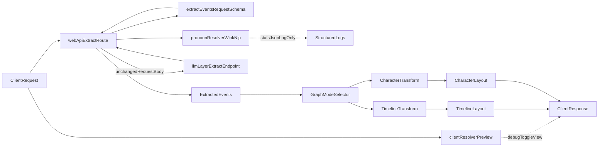

# Web App Architecture

## Overview

`web-app` is a standalone Next.js application used to test extraction-to-graph workflows for story narratives.
It integrates with `llm-layer` over HTTP via a server-side proxy route and now includes a deterministic pronoun-resolution subsystem for observability and debug preview.
Graph rendering supports two client-side modes over the same extracted event payload: timeline and character relations.

Core goals:

- Accept story text from users.
- Submit validated extraction requests to `llm-layer`.
- Transform extracted events into a deterministic graph model.
- Render graph output reliably for interactive testing.
- Run optional pronoun-resolution analysis without mutating upstream extraction payloads in Phase 1.

## Components

- `src/app/page.tsx`
  - Client UI for story input, submission, cancel flow, diagnostics, and graph rendering.
  - Adds a Debug-only pronoun preview panel with explicit `Generate Preview` trigger.

- `src/app/api/extract/route.ts`
  - Server-side proxy endpoint (`/api/extract`) to call `POST /v1/events/extract` on `llm-layer`.
  - Applies request validation, upstream response validation, timeout handling, cancellation propagation, concurrency limits, and error mapping.
  - Runs `resolvePronouns()` only for structured logging when `ENABLE_PRONOUN_RESOLUTION=true`.

- `src/lib/pronoun-resolver.ts`
  - Isomorphic deterministic resolver (Node + browser safe).
  - Uses wink-nlp POS tagging plus rule-based two-pass heuristics for tracked Phase 1 pronouns.

- `src/lib/contracts.ts`
  - Local schema definitions (Zod) for request/response/error payloads.
  - Phase 1 keeps schemas unchanged; pronoun outputs are not forwarded upstream.

- `src/lib/graph-transform.ts`
  - Public graph-transform facade preserving the existing import surface.
  - Dispatches to mode-specific builders under `src/lib/graph-transform/`.

- `src/lib/graph-transform/timeline.ts`
  - Timeline/event-centric builder.
  - Orders events by parseable `timeHint` first (ISO date/datetime, absolute ordinals), with deterministic sequence fallback.
  - Emits per-event `timeOrderingSource` metadata and optional sequence edges.

- `src/lib/graph-transform/character.ts`
  - Character-relation builder.
  - Supports:
    - co-occurrence edges (unordered pair dedup + count aggregation)
    - action-labeled directed edges (`actor -> target`, label from `event.action`)
  - Computes relation-density status and dropped-event diagnostics for UI safeguards.

- `src/lib/graph-layout.ts`
  - Dagre-based layout pass with mode-aware profiles:
    - timeline: LR flow
    - character: TB dense-relation profile

- `src/lib/env.ts` and `src/lib/constants.ts`
  - Environment validation and operational limits (timeouts, max story size, concurrency).
  - Includes `ENABLE_PRONOUN_RESOLUTION`, `PRONOUN_RESOLVER_MAX_CHARS`, and `pronounPreviewMaxChars`.

- `scripts/pronoun-resolver-bench.ts`
  - Repeatable benchmark harness for p99 latency and memory delta checks.

- `test-fixtures/pronoun-eval/`
  - Labeled evaluation corpus (`story` + `mentions[]`) and annotation guideline.

## Data Flow



## Pronoun Resolver (Phase 1)

- Resolver contract (`ResolverResult`) includes:
  - `resolvedStory`
  - `stats` (`pronounsFound`, `pronounsResolved`, `pronounsSkipped`)
  - `applied[]`
  - optional `skipReason` (`input_too_long` or `model_failure`)
- Tracked replacement pronouns:
  - `he`, `him`, `she`, object `her`, `they`, `them`
- Deferred in Phase 1:
  - possessives (`his`, `their`, possessive `her`, etc.)
- Algorithm:
  1. Build PERSON-like mention candidates from proper-noun spans.
  2. Build global gender-hint map using same-sentence, single-entity attribution.
  3. Resolve tracked pronouns in a 3-sentence lookback window when crowding gate has exactly one candidate.
  4. Apply agreement checks with single-candidate `unknown` carve-out.

## Logging Schema

When resolver is enabled on the server, the proxy emits one line of JSON:

```json
{
  "event": "pronoun_resolver",
  "requestId": "uuid",
  "pronounsFound": 2,
  "pronounsResolved": 1,
  "pronounsSkipped": 1,
  "skipReason": null,
  "storyLengthChars": 4200,
  "durationMs": 12
}
```

Privacy constraint: logs must never include raw `story`, `resolvedStory`, or `applied` text.

## Environment and Limits

- `ENABLE_PRONOUN_RESOLUTION` (default `false`)
  - Enables server-side resolver execution for structured logging.
- `PRONOUN_RESOLVER_MAX_CHARS` (default `10000`)
  - Hard cap for server resolver invocation.
- `NEXT_PUBLIC_PRONOUN_RESOLVER_MAX_CHARS` (default `10000`)
  - Client preview guardrail in Debug panel.
- `env.ts` warns at startup when server and client caps diverge.

## Performance and Runtime Safety

- Route runtime forced to Node (`export const runtime = "nodejs"`) for wink compatibility.
- Resolver runs CPU work synchronously on Node event loop; char cap is primary guard.
- Benchmark gate for promotion:
  - `p99 <= 50ms` for stories `<= 10,000` chars.
- Concurrency note:
  - With `appLimits.maxConcurrentRequests=2`, resolver invocations can stack on one event loop; acceptable for current load.
- Memory envelope:
  - Keep RSS increase after first model load at `<= 50MB` per process.

## Compatibility Spike Outcome

- `wink-nlp@2.4.0` and `wink-eng-lite-web-model@1.8.1` are integrated.
- Resolver module remains isomorphic (no Node-only imports in shared module).
- Client preview path uses dynamic import, so resolver/model code is loaded on demand.
- Build verification and chunk-size observation are part of rollout checklist before production-visible preview.

## Phase 1b Schema Parity Checklist (Deferred)

Before forwarding resolver metadata upstream:

1. Confirm `llm-layer` request schema accepts optional metadata extension.
2. Update `web-app` and `llm-layer` contracts in lockstep.
3. Add integration test proving strict-schema parity for old and new payloads.
4. Validate no increase in upstream 4xx/5xx rates.

Until checklist completion, Phase 1 remains **log-only** on the server.

## Rollback

- Set `ENABLE_PRONOUN_RESOLUTION=false` and redeploy.
- No migrations or data cleanup required.
- Because Phase 1 never mutates upstream request body, rollback only removes extra CPU and logs.

## Key Decisions

- **Standalone Boundary**
  - `web-app` stays independent from `llm-layer` internals.
  - Integration contract remains HTTP + schema validation.

- **Server-Side Proxy for Reliability/Security**
  - Keeps `LLM_LAYER_API_KEY` server-side.
  - Avoids browser CORS and centralizes upstream error handling.

- **No Proxy Retries**
  - Proxy performs a single upstream call.

- **Deterministic Graph Model**
  - Event node IDs come from backend `eventId`.
  - Entity node IDs use normalized identity (`trim -> collapse whitespace -> lowercase`).
  - Timeline mode uses parseable `timeHint` ordering with deterministic fallback metadata.
  - Character mode supports co-occurrence and action-labeled relation edges with deterministic IDs.

- **Client-Side Mode Switching**
  - Timeline and Character modes are computed from the same `events[]` payload.
  - Switching modes does not trigger a new extraction request.

- **Character Density Safeguards**
  - Character graphs can be edge-dense; transform computes `densityStatus` (`ok|warn|blocked`) from threshold limits.
  - UI uses transform metadata to warn or block render predictably.

- **Debug Preview is Non-Authoritative**
  - Preview is explicitly "Preview only" and never mutates extraction request body.

## Operational Constraints

- `LLM_LAYER_BASE_URL` must be valid and reachable by the Next.js server.
- If `llm-layer` enforces authentication, `LLM_LAYER_API_KEY` must be configured.
- Production promotion of resolver substitution is deferred to Phase 2 quality gates.

## Phase 2 Promotion Scorecard

Phase 2 changes behavior (upstream may consume `resolvedStory` / substituted `story`), so promotion is gated by a measurable scorecard.

### Metrics

- **Precision** = `correctReplacements / attemptedReplacements`
- **Recall** = `correctReplacements / totalResolvableMentionsInGroundTruth`
- **Coverage** = `attemptedReplacements / totalTrackedPronounMentions`
- **Latency p99** = resolver `durationMs` p99 on benchmark corpus
- **Reliability** = no statistically meaningful increase in upstream `4xx/5xx`

### Scoring Model (0-10)

- **Accuracy (0-5 points)**
  - Precision `>= 90%`: 3 points
  - Recall `>= 70%`: 1 point
  - Coverage `>= 40%`: 1 point
- **Runtime (0-3 points)**
  - p99 `<= 50ms` for stories `<= 10,000` chars: 2 points
  - RSS delta `<= 50MB` after model load: 1 point
- **Safety and Reliability (0-2 points)**
  - Upstream error-rate parity (`4xx/5xx` non-regression): 1 point
  - Contract parity and rollout checks complete (Phase 1b checklist + tests): 1 point

### Decision Thresholds

- **Promote to Phase 2 (enable substitution path):** total score `>= 9/10`
- **Iterate in Phase 1/1b:** total score `7-8.5/10`
- **Do not promote (keep log-only):** total score `< 7/10`

### Current Status

- Current production mode remains **Phase 1 log-only** with optional Debug preview.
- Phase 2 score is **pending** until evaluation corpus metrics and staged reliability checks are completed.
